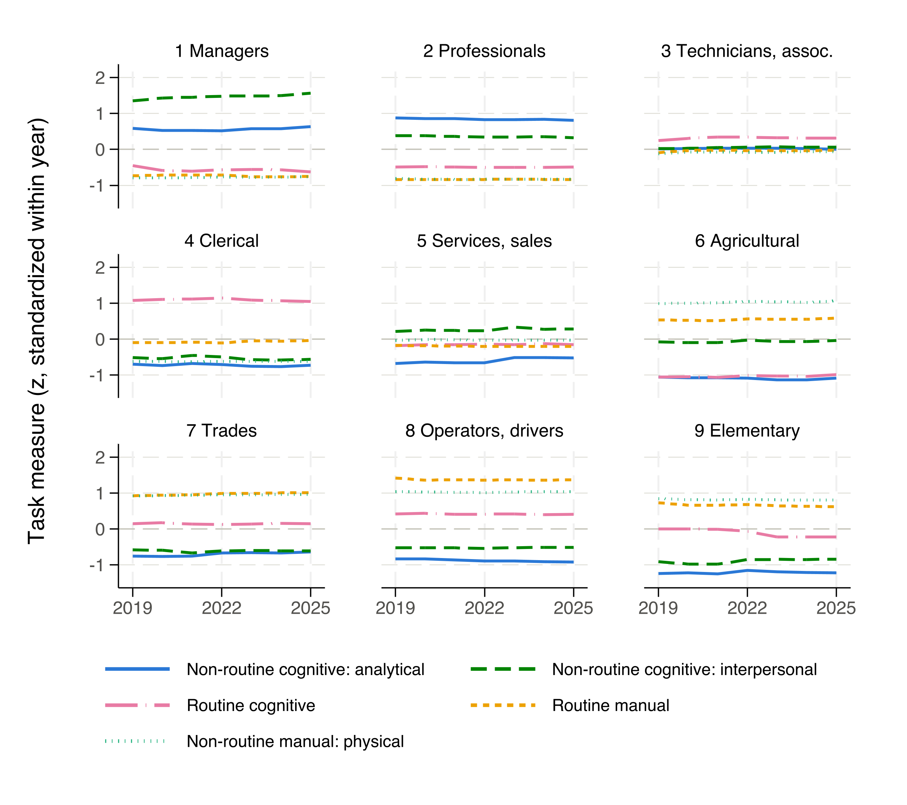
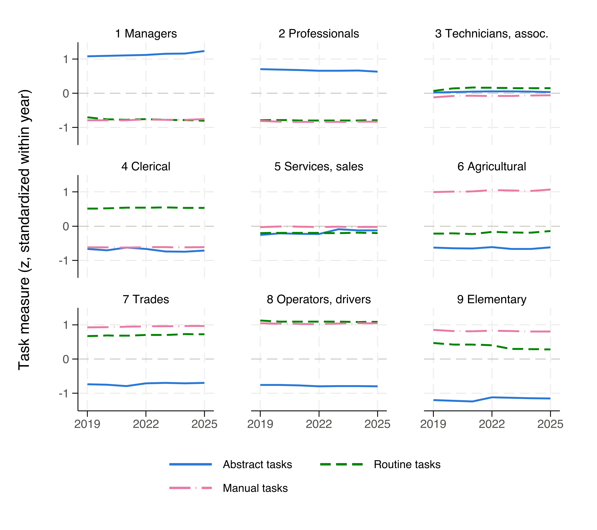

# O\*NET–FEOR

Builds **task-content measures** from the O\*NET database and crosswalks them
to Hungarian **FEOR-08** (4-digit) occupations, for every **data year
2019–2025** (each year from that year's final O\*NET release). The task
taxonomy lives in **swappable definition files** — the rest of the pipeline is
taxonomy-agnostic, and several definitions build in one run, each to its own
output folder. Two ship with the repo: **Acemoglu & Autor (2011)** and
**Autor & Dorn (2013)** — see [Task definitions](#task-definitions).

## How to run

From the **project root** (all paths in the do-files are relative to it):

```stata
do code/00_master.do
```

The master builds the crosswalks once, loops over the `years` and `defs`
macros, then pools each definition into a panel and draws its figure.

## Output

For each definition (`<def>` = `acemoglu-autor-2011`, `autor-dorn-2013`):

- `output/<year>/<def>/task_measures_feor08.dta` — one file per data year;
  one row per FEOR-08 code, the definition's composites in raw (`task_*`) and
  standardized (`task_*_z`) form, plus `feor_08` and `feor_08_name`.
- `output/<def>/task_measures_feor08_panel.dta` — the seven years stacked
  long, one row per FEOR-08 code × `year`.
- `output/<def>/task_trends_feor1.png` — the trend figure shown under
  [Task definitions](#task-definitions).

These files are committed, so the measures can be used without running Stata.
They cover **470–471 of the 485** four-digit FEOR-08 codes, depending on the
year; the gaps are structural — occupations O\*NET never rates — not pipeline
defects. Full audit: [docs/NOTES.md](docs/NOTES.md#feor-08-coverage).

**Cross-year comparability caveat:** the composites are standardized *within*
each year's release (step 05). A value is an occupation's relative position
among that year's occupations; changes across years are changes in relative
position, not in task levels.

## Pipeline (`code/`)

File names sort in run order. Steps 01 and 03–07 take the data year as a
do-file argument (e.g. `do "code/03_append_onet.do" 2023`; step 07 takes the
year list). Step 02 is year-independent.

| Step | File | Scope | What it does |
|------|------|-------|--------------|
| 00 | `00_master.do` | — | Entry point. Runs 02 once, 01+03 per year, 04–06 per year × definition, 07–08 per definition. |
| 01 | `01_download_onet.do` | per year | Ensures the Abilities / Work Activities / Work Context xlsx are in `input/onet_<year>/`. The xlsx are committed; the release zip is downloaded (into the gitignored `raw/` cache) only when they are missing. Holds the year → release map. |
| 02 | `02_build_crosswalks.do` | shared | Builds all four crosswalk legs into `input/crosswalks/`: downloads the O\*NET-SOC 2019 → 2018 SOC mapping, imports the two committed BLS files and the committed KSH transcription (see [Data sources](#data-sources-and-provenance)). |
| 03 | `03_append_onet.do` | per year | Stacks the three Excel files into one long table, every element on every scale. Definition-independent, so Excel parsing happens once per year however many definitions are built. |
| def | `taskdef_*.do` | per def | Defines the task taxonomy: name, elements (and scales) per category, reverse-coding, labels. **The only files with element IDs in them.** |
| 04 | `04_build_elements.do` | year × def | Keeps only the definition's elements, reshapes wide (one variable per element, `SCALE_ELEMENTID`). |
| 05 | `05_build_measures.do` | year × def | Standardizes each element (within the year's release), reverse-codes where flagged, composites = unweighted means of standardized elements, re-standardized (`task_*_z`). |
| 06 | `06_crosswalk_feor.do` | year × def | Crosswalks the composites from O\*NET-SOC down to FEOR-08 (chain depends on the year — see [Crosswalk chain](#crosswalk-chain)). |
| 07 | `07_build_panel.do` | per def | Appends the per-year FEOR-08 files into one long panel with a `year` variable. |
| 08 | `08_plot_trends.do` | per def | Draws the yearly trend figure from the panel (shown under [Task definitions](#task-definitions)). |

## Repository layout

```
code/       the pipeline (master + 8 steps + task definitions)
input/
  crosswalks/          4 derived .dta + the raw BLS/KSH sources   [in git]
  onet_<year>/*.xlsx   the 3 O*NET files the pipeline reads       [in git]
  onet_<year>/raw/     download cache: release zip + unzipped     [ignored]
temp/                  pipeline intermediates                     [ignored]
output/                the task measures + figures                [in git]
```

The three xlsx per data year are committed; the full release zips are not —
they would nearly double the repo size. `01_download_onet.do` re-downloads a
release into the gitignored `raw/` cache only when a year's xlsx are missing,
e.g. after adding a new data year. `temp/` is likewise regenerated in full by
steps 03–06; nothing in it is a source of truth.

## Crosswalk chain

```
2019:       O*NET-SOC 2010 → SOC 2010 → ISCO-08 → FEOR-08
2020–2025:  O*NET-SOC 2019 → SOC 2018 → SOC 2010 → ISCO-08 → FEOR-08
```

For 2020–2025 the two SOC legs are needed because those releases use the
O\*NET-SOC 2019 taxonomy (built on 2018 SOC), while the repo's ISCO-08
crosswalk is keyed to 2010 SOC; there is no direct SOC-2018 → ISCO-08
crosswalk, so it routes through the official BLS SOC-2010 ↔ ISCO-08 mapping.

Data year 2019 skips both 2018-SOC legs (release 24.1 is still on the
O\*NET-SOC 2010 taxonomy — see the [version policy](#the-onet-database)).
Its O\*NET-SOC → SOC 2010 step needs no crosswalk file: by construction, the
first 7 characters of an O\*NET-SOC 2010 code (`XX-XXXX.YY`) *are* its 2010
SOC code, and step 06 takes the substring. (O\*NET publishes no downloadable
2010-taxonomy → SOC crosswalk, so this is also the only option.)

At every leg, occupations that map many-to-one are aggregated with an
unweighted mean — see [Methodology notes](#methodology-notes--decisions).

## Data sources and provenance

All inputs come from official sources and all are committed.

### The O\*NET database

| Data | Source | Handled by |
|------|--------|-----------|
| O\*NET database (Excel) — Abilities, Work Activities, Work Context | [O\*NET Center database releases](https://www.onetcenter.org/database.html) → `db_<ver>_excel.zip` | `01_download_onet.do` |

**Version policy:** each data year uses that year's **final (November)
release**:

| Data year | 2019 | 2020 | 2021 | 2022 | 2023 | 2024 | 2025 |
|-----------|------|------|------|------|------|------|------|
| O\*NET release | 24.1 | 25.1 | 26.1 | 27.1 | 28.1 | 29.1 | 30.1 |

Release 24.1 is the last on the **O\*NET-SOC 2010** taxonomy; 25.0+ use
O\*NET-SOC 2019, which is why 2019 has its own crosswalk chain. To add a data
year, extend the year → release map at the top of `01_download_onet.do` and
the `years` macro in `00_master.do`.

### Built from raw sources (legs 1–3)

`02_build_crosswalks.do` builds these from the raw files in
`input/crosswalks/raw/`, so they are reproducible rather than taken on trust:

| Leg | Crosswalk | Raw file | How it gets there | Official source |
|-----|-----------|----------|-------------------|-----------------|
| 1 | O\*NET-SOC 2019 → SOC 2018 | `2019_to_SOC_Crosswalk.xlsx` | downloaded by step 02 | [O\*NET-SOC 2019 taxonomy](https://www.onetcenter.org/taxonomy/2019/soc.html) |
| 2 | SOC 2010 ↔ SOC 2018 | `soc_2010_to_2018_crosswalk.xlsx` | committed | [BLS 2018 SOC crosswalks](https://www.bls.gov/soc/2018/crosswalks.htm) |
| 3 | SOC 2010 ↔ ISCO-08 | `ISCO_SOC_Crosswalk.xls` | committed | [BLS 2010 SOC crosswalks](https://www.bls.gov/soc/soccrosswalks.htm) |

The two BLS files are committed rather than fetched because BLS returns
**HTTP 403** to `curl` and Stata's `copy` — the direct links
(`https://www.bls.gov/soc/2018/soc_2010_to_2018_crosswalk.xlsx`,
`https://www.bls.gov/soc/ISCO_SOC_Crosswalk.xls`) are correct but succeed
only from an interactive browser session.

Leg 3 needs one fix-up: BLS maps a few SOC codes to 3-digit ISCO *minor
groups*, which step 02 expands to their 4-digit unit groups — see
[docs/NOTES.md](docs/NOTES.md#leg-3-minor-group-expansion).

### Transcribed from the KSH PDF (leg 4)

KSH publishes the ISCO-08 → FEOR-08 mapping only as a **PDF**
([direct link](https://www.ksh.hu/docs/osztalyozasok/feor/fordkulcs_isco_feor_hu.pdf),
[KSH FEOR-08 menu](https://www.ksh.hu/feor_menu),
[methodology](https://www.ksh.hu/docs/osztalyozasok/feor/feor_isco_modsz_utmut_2013_12_19.pdf);
committed at `input/crosswalks/raw/fordkulcs_isco_feor_hu.pdf`), which Stata
cannot read. The committed CSV next to it is a faithful transcription of the
PDF's table, produced by `code/extract_isco08_feor08_pdf.py`;
`02_build_crosswalks.do` builds `crosswalk_isco08_feor08.dta` from the CSV.
Transcription details and verification:
[docs/NOTES.md](docs/NOTES.md#leg-4-the-ksh-pdf-transcription).

## Methodology notes / decisions

- **Aggregation is by unweighted mean throughout** — both when averaging
  standardized elements into a composite (step 05) and when collapsing across
  matched occupations at each crosswalk leg (step 06: `joinby` expands all
  matches, then `collapse (mean)`). This matches the standard task literature
  (Autor-Levy-Murnane 2003; Acemoglu-Autor 2011; Autor-Dorn 2013), which uses
  equal-weighted averages of standardized items. There is no employment
  weighting: the repo has no Hungarian employment counts by FEOR/ISCO, and US
  employment weights would be wrong for the Hungarian occupational structure
  anyway.
- **Scales**: Importance (IM) for Abilities / Work Activities elements,
  Context (CX) for Work Context. The CXP (category-distribution) and CT/CTP
  scales in the Work Context file are dropped — a row is kept only if its
  `scaleid` matches the token's scale.
- **Reverse coding**: 4.C.3.b.8 (Structured versus Unstructured Work) is
  reversed, because a high value means high autonomy, i.e. *less* routine.
- **Occupations missing a required element are dropped, not averaged over.**
  If an occupation lacks any element the definition names, step 04 drops it
  (listing it in the log) rather than building its composite from fewer items
  than every other occupation's. The only instance across 2019–2025: O\*NET
  24.1 publishes no 4.C.3.b.8 value for 15-2091.00 *Mathematical
  Technicians*, so that occupation is absent from data year 2019.

## Conventions

- All paths are **relative to the project root**; do-files assume that is the
  working directory. No absolute paths, no path globals.
- Globals hold **only** the task specification (`$taskdef_name`, `$taskcats`,
  `$els_*`, `$rev_els`, `$lab_*`), never file paths. Each `taskdef_*.do`
  drops the previous definition's globals before setting its own, so nothing
  leaks between definitions in a multi-definition run.
- The data year is a **do-file argument** (`args year`), not a global; steps
  01 and 03–07 default to 2022 (07: to all years) when run standalone.
- Steps 04–08 self-load the default task definition if run standalone with no
  definition in memory.

## Task definitions

Every definition lists its elements as `SCALE:ELEMENTID` tokens, where
`SCALE` is the O\*NET scale to read — `IM` (Importance) for Abilities / Work
Activities, `CX` (Context) for Work Context.

For each definition, step 08 draws the panel as yearly trends by 1-digit
FEOR major group (first digit of `feor_08`, English glosses of the KSH group
names): one panel per major group, one line per task measure — each line the
unweighted mean of a `task_*_z` across the group's 4-digit codes. Major
group 0 (armed forces) is excluded: two of its three codes are never rated
in O\*NET and the third rests on a single thin source (see the
[coverage audit](docs/NOTES.md#feor-08-coverage)), so its line would be more
artifact than signal. Per the [comparability caveat](#output), a line shows
a group's relative position moving, not its task content changing level —
and flatness is expected: O\*NET re-rates only a slice of occupations per
release, so year-to-year movement within a group is small by construction.

### Acemoglu & Autor (2011) — `acemoglu-autor-2011`

| Category (code) | O\*NET elements |
|-----------------|-----------------|
| Non-routine cognitive: analytical (`nrca`) | 4.A.2.a.4 Analyzing Data or Information; 4.A.2.b.2 Thinking Creatively; 4.A.4.a.1 Interpreting the Meaning of Information for Others |
| Non-routine cognitive: interpersonal (`nrci`) | 4.A.4.a.4 Establishing and Maintaining Interpersonal Relationships; 4.A.4.b.4 Guiding, Directing, and Motivating Subordinates; 4.A.4.b.5 Coaching and Developing Others |
| Routine cognitive (`rc`) | 4.C.3.b.7 Importance of Repeating Same Tasks; 4.C.3.b.4 Importance of Being Exact or Accurate; 4.C.3.b.8 Structured versus Unstructured Work *(reverse-coded)* |
| Routine manual (`rm`) | 4.C.3.d.3 Pace Determined by Speed of Equipment; 4.A.3.a.3 Controlling Machines and Processes; 4.C.2.d.1.i Spend Time Making Repetitive Motions |
| Non-routine manual: physical (`nrmp`) | 4.A.3.a.4 Operating Vehicles, Mechanized Devices, or Equipment; 4.C.2.d.1.g Spend Time Using Your Hands to Handle, Control, or Feel Objects; 1.A.2.a.2 Manual Dexterity; 1.A.1.f.1 Spatial Orientation |

Reference: Acemoglu, D. & Autor, D. (2011), "Skills, Tasks and Technologies:
Implications for Employment and Earnings", *Handbook of Labor Economics* 4B.



### Autor & Dorn (2013) — `autor-dorn-2013`

The three task aggregates behind Autor & Dorn's routine task intensity (RTI)
index. **Provenance caveat:** the original Autor–Dorn measures come from the
1977 DOT, not O\*NET; this is the standard O\*NET adaptation used in the later
literature, building the aggregates from the same 16 elements as the
Acemoglu–Autor composites — only the grouping differs:

| Category (code) | Composition |
|-----------------|-------------|
| Abstract (`abstract`) | the `nrca` + `nrci` elements (6) |
| Routine (`routine`) | the `rc` + `rm` elements (6), 4.C.3.b.8 reverse-coded as above |
| Manual (`manual`) | the `nrmp` elements (4) |

RTI itself is deliberately not in the output. The original
`ln(R) − ln(A) − ln(M)` is undefined for standardized scores, and the
literature's z-score version is a linear combination —

```stata
generate rti = task_routine_z - task_abstract_z - task_manual_z
```

— which commutes with the unweighted means used at every crosswalk leg, so
building it from the FEOR-level output (one line, above) is identical to
crosswalking an occupation-level RTI.

Reference: Autor, D. & Dorn, D. (2013), "The Growth of Low-Skill Service Jobs
and the Polarization of the US Labor Market", *American Economic Review*
103(5).



### Adding a task definition

1. Copy `taskdef_acemoglu_autor_2011.do` to e.g. `taskdef_myversion.do`.
2. Set `$taskdef_name` to a filesystem-safe slug (e.g. `my-version`). It
   names the definition's output folder, so definitions never overwrite each
   other.
3. Edit the element lists (`$els_*`), the category list (`$taskcats`), the
   reverse-code list (`$rev_els`), and the labels (`$lab_*`). Categories can
   be added or removed freely — the engine adapts.
4. Add the suffix to the `defs` macro in `00_master.do`:

```stata
local defs "acemoglu_autor_2011 autor_dorn_2013 myversion"
```

That's all. Every definition is then built in one run, each writing to its
own `output/<year>/<slug>/` folders plus a panel and figure. The O\*NET
Excel files are parsed once per year (step 03) and shared by all, and no step
outside the `taskdef_*.do` files needs editing.

## Licence

The **code** in this repository is released under the [MIT Licence](LICENSE).

The **data** carries the terms of its original publishers, not the MIT licence:

- **O\*NET** data is published by the U.S. Department of Labor, Employment and
  Training Administration under [CC BY 4.0](https://creativecommons.org/licenses/by/4.0/).
  O\*NET® is a trademark of USDOL/ETA.
- **BLS** crosswalks (SOC 2010 ↔ 2018, SOC ↔ ISCO-08) are U.S. Government works
  in the public domain.
- **KSH** FEOR-08 material is published by the Hungarian Central Statistical
  Office under its own terms.

If you use these measures, cite the paper behind the task definition you use
(Acemoglu & Autor 2011; Autor & Dorn 2013) and the O\*NET database release
for the underlying data.
